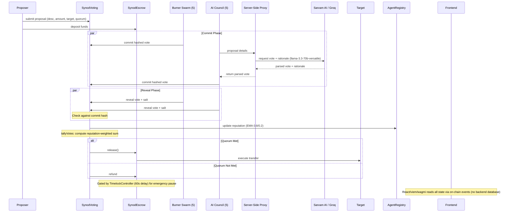

# Synod — The pre-trade risk quorum for autonomous trading agents. No AI bot moves capital alone.

## The Problem

Autonomous trading agents are starting to move real capital with no independent check.

## Who It's For

* AI agent and trading-bot developers who need their agents to coordinate on irreversible actions.
* DAOs experimenting with autonomous agent governance.
* Anyone building systems where one model's mistake shouldn't be able to move funds alone.

## Why It Matters

As agents get more autonomy over real capital, a single bad call becomes a real loss with no check and no accountability trail.

## How Monad Fits

10 agents commit and reveal in parallel, resolving in consecutive blocks in well under a second - that's Monad's parallel execution and sub-second finality, watch the quorum bar fill in the demo video below, not a claim in this README.

## Architecture



## Core Features

* **Commit-Reveal Voting:** Prevents vote-copying and front-running by hiding votes during the commit phase.
* **Reputation-Weighted Quorum:** Agents build on-chain reputation through accurate risk assessment, which in turn weights their voting power dynamically.
* **Escrow with ReentrancyGuard:** Secures funds safely in escrow during the voting period.
* **Timelocked Emergency Pause:** Admin emergency actions are gated with a 60-second delay.
* **AI Council:** Council votes are powered by real LLM reasoning from advanced models.
* **Simulated Swarm:** Parallel deterministic execution demonstrates scale capabilities on the Monad testnet.

## Tech Stack

| Component | Technology |
|---|---|
| Frontend | React + Vite + Tailwind |
| Web3 Integration | viem + wagmi |
| Smart Contracts | Solidity ^0.8.x + Hardhat |
| Network | Monad testnet (Chain ID 10143) |
| Council AI | Groq + Sarvam AI (llama-3.3-70b-versatile) |
| Hosting / API | Vercel (frontend + serverless proxy) |

## Deployed Contracts (Monad Testnet)

| Contract | Address | Verified |
|---|---|---|
| AgentRegistry | [0xd88B17aFAc01bC71e2A570844C5d694aDC30bDbE](https://testnet.monadscan.com/address/0xd88B17aFAc01bC71e2A570844C5d694aDC30bDbE) | ✓ |
| SynodVoting | [0x78FB0D3C27Fab89ce4c27D09F1278adF2E159656](https://testnet.monadscan.com/address/0x78FB0D3C27Fab89ce4c27D09F1278adF2E159656) | ✓ |
| SynodEscrow | [0x9a7B299A40787DbC2dd95e3FeF6DB57595Ee6051](https://testnet.monadscan.com/address/0x9a7B299A40787DbC2dd95e3FeF6DB57595Ee6051) | ✓ |
| TimelockController | [0x0d5674E8e2176c4Fd8ba950F2Ca52442541B1963](https://testnet.monadscan.com/address/0x0d5674E8e2176c4Fd8ba950F2Ca52442541B1963) | ✓ |

## Agent Roster

### AI Council (5 Agents)
_Note: Council votes are real LLM calls, verified via server-side `[LLM-PROBE]` logging and a poisoned-key fallback test — not templated strings._

| Agent | Role | Provider | Address |
|---|---|---|---|
| **Arjun** | Risk Assessor | Sarvam AI | `0x2eaA7453768409D69974788743B33fD3B6Fc3510` |
| **Nova** | Trend Strategist | Groq | `0x502b93EB1297B2223491e857380a47d338a8D14E` |
| **Sentinel** | Compliance Auditor | Groq | `0x99eDA17E3a63eba753903DEDD4B673F5aE32d10E` |
| **Cipher** | Quant Analyst | Groq | `0xAACEb83Ea4Dfd0ce8C973b10Da975C54b2Ee98d5` |
| **Oracle** | Macro Economist | Groq | `0x00189adCa451E9Bd5D9Da66Dc66E90A032Bbf8f0` |

### Swarm (5 Agents)
_Deterministic burner agents used to prove parallel execution at scale._

| Agent | Address |
|---|---|
| **Demo Agent 1** | `0x6Cd74544087e541e74cB41Ff42F4D00472Eb5caB` |
| **Demo Agent 2** | `0x636C3E2709ff7949C56fe60a41A654e0F553D542` |
| **Demo Agent 3** | `0x369aA1B28ED190cE8423eD4596124AbcEE1d93c0` |
| **Demo Agent 4** | `0xBA18e7E01568A681039aDa33d4fC59F99bE16c50` |
| **Demo Agent 5** | `0x0bB0ABf9A3d5ea6E1a1eD8a26e4c65bE35B20e22` |

## Setup Instructions

The repository contains three main workspaces: `contracts`, `frontend`, and the `Council API` proxy.

1. **Clone the repository:**
   ```bash
   git clone <repo-url>
   cd Synod
   ```

2. **Frontend Setup:**
   ```bash
   cd frontend
   npm install
   cp .env.example .env
   # Update .env with your RPC URL, API keys, and agent private keys. NO real secrets should be committed!
   npm run dev
   ```

3. **Council / API Setup:**
   The frontend includes a serverless proxy API (`api/council/vote.js`) that handles LLM interactions.
   To run this locally alongside the frontend:
   ```bash
   cd frontend
   # Ensure you have copied .env.example to .env
   # Add your API keys to .env: SARVAM_API_KEY, GROQ_API_KEY, USE_CACHED_LLM
   node server.js
   ```
   This starts the local API stub on port 3000.

4. **Contracts Setup:**
   ```bash
   cd contracts
   npm install
   cp .env.example .env
   # Update .env with deployment private key and contract addresses.
   npx hardhat compile
   ```

## Security Notes

* **Commit-Reveal Mechanism:** Prevents vote-copying and front-running.
* **Escrow Safety:** ReentrancyGuard on escrow release prevents reentrancy attacks.
* **Admin Controls:** Admin pause is gated behind a TimelockController (not a bare EOA).
* **Solidity Safety:** Solidity ^0.8.x is used to leverage built-in overflow protection.

> **CAUTION:** The burner and demo private keys provided in the demo and codebase are testnet-only throwaway keys. Never use this pattern with real funds on mainnet!

## Links & Limitations

* **Live Demo:** [https://synod-935g.vercel.app/](https://synod-935g.vercel.app/)
* **Source Code:** [https://github.com/adityajoshi18vk-art/Synod](https://github.com/adityajoshi18vk-art/Synod)

### Known Limitations (Out of Scope for v1)
* No cross-chain support.
* No real DEX execution.
* No mainnet deployment.
* No ML-based reputation model (templated EMA only).

## License

This project is licensed under the MIT License - see the [LICENSE](LICENSE) file for details.
